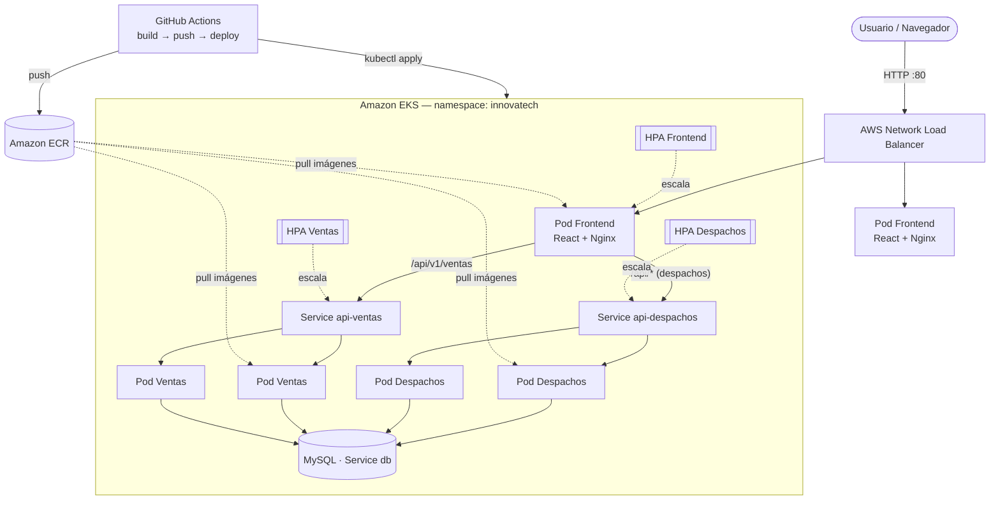

# Innovatech Chile — Orquestación y CI/CD en AWS EKS (EP3 DevOps)

Sistema de gestión de **despachos y ventas** desplegado de forma **escalable, tolerante a fallos y automatizada** sobre **Amazon EKS (Kubernetes)**, con imágenes en **Amazon ECR** y un pipeline **CI/CD en GitHub Actions** que automatiza `build → push → deploy`.

> Asignatura: **ISY1101 — Introducción a Herramientas DevOps** · Evaluación Parcial N°3
> Contexto: la empresa *Innovatech Chile*, tras contenerizar (EP2) y montar infraestructura base (EP1), avanza hacia la **orquestación productiva**.

---

## Tabla de contenidos

1. [Arquitectura](#1-arquitectura)
2. [Estructura del repositorio](#2-estructura-del-repositorio)
3. [Mapeo a indicadores de evaluación (IE1–IE7)](#3-mapeo-a-indicadores-de-evaluación-ie1ie7)
4. [Requisitos previos](#4-requisitos-previos)
5. [Despliegue paso a paso](#5-despliegue-paso-a-paso)
6. [CI/CD con GitHub Actions](#6-cicd-con-github-actions)
7. [Autoscaling: prueba y evidencia](#7-autoscaling-prueba-y-evidencia)
8. [Logs, métricas y validación funcional](#8-logs-métricas-y-validación-funcional)
9. [Gestión de secrets](#9-gestión-de-secrets)
10. [Ejecución local (desarrollo)](#10-ejecución-local-desarrollo)
11. [Troubleshooting](#11-troubleshooting)
12. [Limpieza (evitar gasto de créditos)](#12-limpieza-evitar-gasto-de-créditos)

---

## 1. Arquitectura

El sistema está compuesto por **3 microservicios contenerizados** + base de datos, todos orquestados por Kubernetes en un namespace `innovatech`:

| Componente | Tecnología | Service K8s | Tipo | Expuesto |
|---|---|---|---|---|
| **Frontend** | React + Vite + Nginx | `front-despacho` | LoadBalancer (NLB) | **Sí, público** |
| **Backend Despachos** | Spring Boot (Java 17) | `api-despachos` | ClusterIP | No (interno) |
| **Backend Ventas** | Spring Boot (Java 17) | `api-ventas` | ClusterIP | No (interno) |
| **Base de datos** | MySQL 8 | `db` | ClusterIP | No (interno) |

**Comunicación Front → Back:** el navegador siempre llama a `/api/...` (mismo origen que el frontend). **Nginx** dentro del pod del frontend actúa como **reverse proxy** y reenvía la petición al microservicio interno correspondiente por **DNS de Kubernetes**:

- `/api/v1/ventas` → Service `api-ventas:8080`
- `/api/...` (resto, incluye `/api/v1/despachos`) → Service `api-despachos:8080`

Así, **solo el frontend está expuesto a Internet** (vía el NLB) y los backends quedan privados dentro del clúster.



> Diagrama y justificación detallada (roles IAM, redes, decisiones) en **[docs/ARQUITECTURA.md](docs/ARQUITECTURA.md)**.

---

## 2. Estructura del repositorio

```
proyecto-semestral-devops/
├── back-Despachos_SpringBoot/        # Microservicio Despachos (Spring Boot + Dockerfile)
├── back-Ventas_SpringBoot/           # Microservicio Ventas (Spring Boot + Dockerfile)
├── front_despacho/                   # Frontend React + Nginx (Dockerfile + nginx.conf)
├── k8s/                              # Manifests de Kubernetes (numerados por orden de aplicación)
│   ├── 01-namespace.yaml
│   ├── 02-mysql-secret.yaml          # Plantilla del Secret (sin contraseña real)
│   ├── 03-mysql-deployment-svc.yaml
│   ├── 04-backend-despachos-deployment-svc.yaml
│   ├── 05-backend-ventas-deployment-svc.yaml
│   ├── 06-frontend-deployment-svc.yaml
│   ├── 07-backend-despachos-hpa.yaml
│   ├── 08-backend-ventas-hpa.yaml
│   └── 09-frontend-hpa.yaml
├── infra/
│   └── eksctl-cluster.yaml           # Definición del clúster EKS (AWS Academy / LabRole)
├── scripts/
│   ├── create-ecr.sh                 # Crea los repos de ECR
│   ├── build-and-push.sh             # Build + push de las 3 imágenes a ECR
│   ├── deploy.sh                     # Despliegue completo en EKS
│   └── load-test.sh                  # Generador de carga para probar el autoscaling
├── .github/workflows/
│   └── ci-cd-eks.yml                 # Pipeline CI/CD (build → push → deploy)
├── docker-compose.yml                # Ejecución local (desarrollo)
├── .env.example                      # Plantilla de variables de entorno
└── README.md
```

---

## 3. Mapeo a indicadores de evaluación (IE1–IE7)

| Indicador | Dónde se cumple |
|---|---|
| **IE1 — Configuración del clúster AWS (EKS)** | `infra/eksctl-cluster.yaml` (VPC, subredes, nodos, IAM/LabRole) · [§5.2](#52-crear-el-clúster-eks) |
| **IE2 — Despliegue Frontend + Backend** | `k8s/04`, `k8s/05`, `k8s/06` (imágenes desde ECR, variables, NLB público, comunicación interna) |
| **IE3 — Autoscaling** | `k8s/07`, `k8s/08`, `k8s/09` (HPA) + `scripts/load-test.sh` · [§7](#7-autoscaling-prueba-y-evidencia) |
| **IE4 — Pipeline CI/CD (build → push → deploy)** | `.github/workflows/ci-cd-eks.yml` · [§6](#6-cicd-con-github-actions) |
| **IE5 — Gestión de Secrets** | Secret de K8s para la BD + GitHub Secrets para AWS, sin credenciales versionadas · [§9](#9-gestión-de-secrets) |
| **IE6 — Análisis de logs, métricas y tiempos** | [§8](#8-logs-métricas-y-validación-funcional) (kubectl logs/top, eventos del HPA, tiempos del pipeline) |
| **IE7 — Validación funcional del clúster (Front → Back)** | [§8](#8-logs-métricas-y-validación-funcional) (health checks, CRUD end-to-end, recuperación post-deploy) |

---

## 4. Requisitos previos

**Cuenta:** AWS Academy **Learner Lab** activo (entrega credenciales temporales con *session token*).

**Herramientas locales:**

| Herramienta | Verificar |
|---|---|
| AWS CLI v2 | `aws --version` |
| kubectl | `kubectl version --client` |
| eksctl | `eksctl version` |
| Docker | `docker --version` |
| git | `git --version` |

**Configurar credenciales de AWS Academy** (cópialas desde *AWS Details → AWS CLI* en el Learner Lab):

```bash
# ~/.aws/credentials  (perfil default)
[default]
aws_access_key_id=ASIA...
aws_secret_access_key=...
aws_session_token=...
```

> ⚠️ Las credenciales del Learner Lab **expiran al cerrar la sesión** (~4 h). Si el despliegue empieza a fallar con errores de autenticación, vuelve a copiarlas (y a actualizar los GitHub Secrets, ver [§6](#6-cicd-con-github-actions)).

---

## 5. Despliegue paso a paso

### 5.1 Clonar y preparar variables

```bash
git clone <tu-repo>.git
cd proyecto-semestral-devops
cp .env.example .env          # ajusta MYSQL_ROOT_PASSWORD si quieres
export AWS_REGION=us-east-1
export MYSQL_ROOT_PASSWORD=admin123
```

### 5.2 Crear el clúster EKS

1. Obtén el ID de tu cuenta y reemplázalo en `infra/eksctl-cluster.yaml` (campo `<ACCOUNT_ID>`):

   ```bash
   aws sts get-caller-identity --query Account --output text
   ```

2. Crea el clúster (tarda **~15–20 min**; eksctl provisiona VPC, subredes públicas/privadas, security groups y el nodegroup):

   ```bash
   eksctl create cluster -f infra/eksctl-cluster.yaml
   ```

3. Conecta `kubectl` al clúster y verifica los nodos:

   ```bash
   aws eks update-kubeconfig --name innovatech-eks --region us-east-1
   kubectl get nodes
   ```

> En **Learner Lab no se pueden crear roles IAM**: por eso `eksctl-cluster.yaml` **reutiliza el rol `LabRole`** para el plano de control y los nodos. `LabRole` ya incluye permisos de ECR, por lo que los nodos pueden descargar las imágenes **sin `imagePullSecrets`**.

### 5.3 Instalar metrics-server (necesario para el HPA)

El Horizontal Pod Autoscaler necesita métricas de CPU/memoria:

```bash
kubectl apply -f https://github.com/kubernetes-sigs/metrics-server/releases/latest/download/components.yaml
# Espera ~1 min y verifica:
kubectl top nodes
```

### 5.4 Crear los repositorios de ECR

```bash
./scripts/create-ecr.sh        # crea despachos-backend, ventas-backend, frontend-despacho
```

### 5.5 Construir y subir las imágenes

Puedes hacerlo **manualmente** (útil la primera vez) o dejar que lo haga el **pipeline CI/CD** ([§6](#6-cicd-con-github-actions)).

```bash
IMAGE_TAG=latest ./scripts/build-and-push.sh
```

### 5.6 Desplegar en EKS

```bash
IMAGE_TAG=latest ./scripts/deploy.sh
```

El script inyecta el registry de ECR (derivado de tu cuenta) y el tag en los manifests, crea el Secret de la BD de forma segura y espera a que los Deployments queden disponibles.

### 5.7 Obtener la URL pública y validar

```bash
kubectl -n innovatech get svc front-despacho \
  -o jsonpath='{.status.loadBalancer.ingress[0].hostname}'
```

Abre esa URL en el navegador. El backend se valida con:

```bash
FRONT=$(kubectl -n innovatech get svc front-despacho -o jsonpath='{.status.loadBalancer.ingress[0].hostname}')
curl http://$FRONT/api/v1/despachos/health   # {"status":"UP","service":"despachos",...}
curl http://$FRONT/api/v1/ventas/health       # {"status":"UP","service":"ventas",...}
```

---

## 6. CI/CD con GitHub Actions

El workflow [`.github/workflows/ci-cd-eks.yml`](.github/workflows/ci-cd-eks.yml) automatiza **build → push → deploy** en cada `push` a `main`/`master` (o manualmente con *Run workflow*).

**Configura los Secrets del repositorio** (GitHub → *Settings → Secrets and variables → Actions*):

| Secret | Valor |
|---|---|
| `AWS_ACCESS_KEY_ID` | de AWS Academy |
| `AWS_SECRET_ACCESS_KEY` | de AWS Academy |
| `AWS_SESSION_TOKEN` | de AWS Academy (¡se renueva cada sesión!) |
| `MYSQL_ROOT_PASSWORD` | la contraseña de la BD |

**Qué hace el pipeline:**

1. Configura credenciales AWS y hace login en ECR (el registry se obtiene solo, sin hardcodear la cuenta).
2. Construye y sube las 3 imágenes etiquetadas con el **SHA corto del commit** (trazabilidad).
3. Conecta `kubectl` al clúster (`aws eks update-kubeconfig`).
4. Crea/actualiza el Secret de MySQL desde el GitHub Secret.
5. Aplica los manifests (sustituyendo registry y tag) y espera el `rollout`.
6. Imprime el estado y la URL pública.

> El `deploy` usa `kubectl rollout`, de modo que cada commit produce un **despliegue progresivo (rolling update)** sin downtime.

---

## 7. Autoscaling: prueba y evidencia

Hay un **HPA por servicio** (`k8s/07`, `k8s/08`, `k8s/09`):

| Servicio | Mín | Máx | Umbral CPU | Justificación |
|---|---|---|---|---|
| `api-despachos` | 2 | 5 | 60 % | Carga de negocio; 60 % deja margen para picos sin escalar prematuramente |
| `api-ventas` | 2 | 5 | 60 % | Igual criterio que despachos |
| `front-despacho` | 2 | 5 | 50 % | Punto de entrada público: conviene que reaccione antes |

**Probar el escalado** (dos terminales):

```bash
# Terminal 1 — observar el HPA y las réplicas en vivo
kubectl -n innovatech get hpa -w
kubectl -n innovatech top pods

# Terminal 2 — generar carga
./scripts/load-test.sh                 # ataca api-despachos
# o:  TARGET=http://api-ventas:8080/api/v1/ventas ./scripts/load-test.sh
```

Verás cómo la columna `REPLICAS` del HPA sube de 2 hacia 5 cuando el uso de CPU supera el umbral, y cómo **vuelve a bajar** unos minutos después de detener la carga (Ctrl+C). Captura esto para la evidencia de **IE3**.

---

## 8. Logs, métricas y validación funcional

**Logs (IE6):**

```bash
kubectl -n innovatech logs -l app=api-despachos -f      # logs del backend en vivo
kubectl -n innovatech logs -l app=frontend --tail=50
kubectl -n innovatech get events --sort-by=.lastTimestamp
```

**Métricas (IE6):**

```bash
kubectl -n innovatech top pods                          # CPU/memoria por pod
kubectl -n innovatech describe hpa api-despachos-hpa    # eventos de escalado
```

**Tiempos del pipeline (IE6):** en la pestaña **Actions** de GitHub cada ejecución muestra la duración por etapa (build, push, deploy) y los logs completos.

**Validación funcional Front → Back (IE7):**

1. Abre la URL pública del frontend → debería cargar la SPA.
2. Las tablas de **Despachos** y **Compras/Ventas** consumen los backends vía el proxy `/api`.
3. Health checks: `curl http://$FRONT/api/v1/despachos/health` y `.../ventas/health`.
4. **Recuperación post-deploy:** fuerza un redeploy y observa el rolling update sin caída:

   ```bash
   kubectl -n innovatech rollout restart deployment/api-despachos
   kubectl -n innovatech rollout status  deployment/api-despachos
   ```

5. **Tolerancia a fallos:** elimina un pod y Kubernetes lo recrea solo:

   ```bash
   kubectl -n innovatech delete pod -l app=api-despachos --wait=false
   kubectl -n innovatech get pods -w
   ```

---

## 9. Gestión de secrets

- **Contraseña de la BD:** vive en un **Secret de Kubernetes** (`db-credentials`) y se inyecta a los pods con `secretKeyRef`. **Nunca** se escribe en texto plano en un Deployment.
- **El Secret no se versiona:** `k8s/02-mysql-secret.yaml` es solo una **plantilla** con el placeholder `${MYSQL_ROOT_PASSWORD}`; el valor real se inyecta en el despliegue (envsubst en local, o `kubectl create secret` desde un GitHub Secret en CI).
- **Credenciales de AWS:** viven como **GitHub Secrets**, nunca en el código. El registry de ECR se deriva en runtime con `aws sts get-caller-identity` (sin IDs de cuenta hardcodeados).
- **`.gitignore`** excluye `.env` y kubeconfigs para no filtrar credenciales.

---

## 10. Ejecución local (desarrollo)

Para probar sin AWS, con Docker Compose (levanta MySQL + backend Despachos + frontend):

```bash
docker compose up --build
# Frontend en http://localhost  ·  API en http://localhost:8080
```

Para el frontend en modo dev (Vite con hot-reload y proxy a los backends locales):

```bash
cd front_despacho
npm install
npm run dev        # http://localhost:5173
```

---

## 11. Troubleshooting

| Síntoma | Causa probable / Solución |
|---|---|
| El `Service front-despacho` queda en `<pending>` | El NLB tarda 1–3 min en provisionarse. Revisa `kubectl -n innovatech describe svc front-despacho`. |
| Pods en `ImagePullBackOff` | El rol de los nodos no puede leer de ECR. En Learner Lab usa `LabRole` (ya incluido). *Fallback:* `kubectl -n innovatech create secret docker-registry ecr-registry-key --docker-server=$ECR_REGISTRY --docker-username=AWS --docker-password=$(aws ecr get-login-password)` y referenciarlo con `imagePullSecrets`. |
| HPA muestra `TARGETS: <unknown>` | Falta `metrics-server` o aún no junta métricas. Reinstala ([§5.3](#53-instalar-metrics-server-necesario-para-el-hpa)) y espera 1 min. |
| Backend `CrashLoopBackOff` con error de BD | MySQL aún no está listo. La `startupProbe` da margen; revisa `kubectl -n innovatech logs <pod>` y que el Secret exista. |
| Frontend (Nginx) `CrashLoop` al iniciar | Nginx resuelve `api-despachos`/`api-ventas` al arrancar: ambos Services deben existir. Aplica los manifests en orden numérico (lo hace `deploy.sh`). |
| `error: You must be logged in to the server (Unauthorized)` | Credenciales/`session token` de AWS Academy expirados. Recárgalas y repite `aws eks update-kubeconfig`. |
| `eksctl` falla creando roles IAM | Learner Lab no permite crear IAM. Asegúrate de usar `infra/eksctl-cluster.yaml` con `LabRole`. |

---

## 12. Limpieza (evitar gasto de créditos)

Al terminar la demostración, **elimina el clúster** para no consumir créditos del laboratorio:

```bash
eksctl delete cluster --name innovatech-eks --region us-east-1
```

Opcionalmente, borra las imágenes de ECR desde la consola o con `aws ecr delete-repository --repository-name <repo> --force`.
