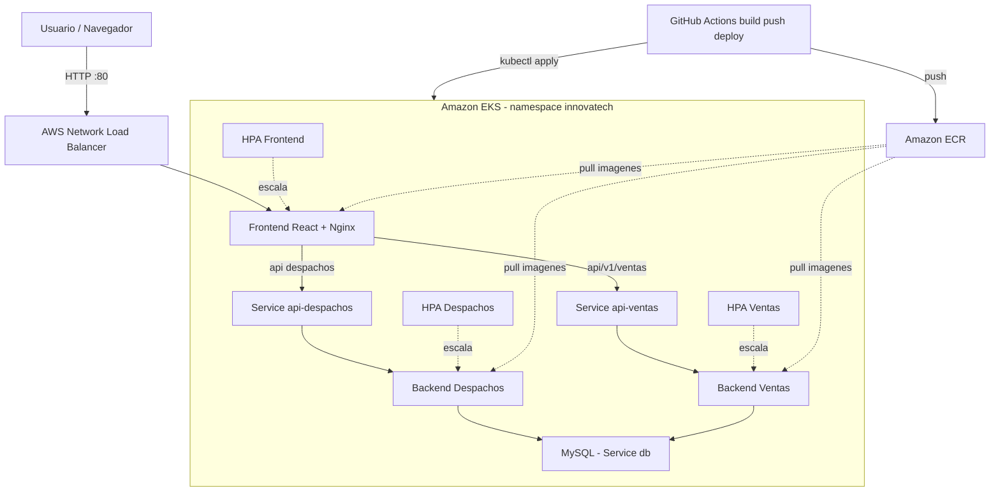

# Evaluación Final Transversal DevOps

Sistema de gestión de despachos y ventas desplegado de forma automatizada sobre **Amazon EKS (Kubernetes)**, utilizando imágenes Docker almacenadas en **Amazon ECR** y un pipeline **CI/CD en GitHub Actions** que automatiza el flujo:

```text
build → push → deploy
```

**Asignatura:** ISY1101 — Introducción a Herramientas DevOps  
**Evaluación:** Evaluación Final Transversal  
**Contexto:** Plataforma compuesta por frontend, microservicios backend y base de datos relacional, desplegada en AWS Academy mediante contenedores y orquestación Kubernetes.

---

## 1. Arquitectura

El sistema está compuesto por frontend, dos microservicios backend y una base de datos MySQL. Todos los servicios se ejecutan en contenedores Docker y son orquestados mediante Kubernetes en Amazon EKS.

| Componente | Tecnología | Servicio K8s | Tipo | Expuesto |
|---|---|---|---|---|
| Frontend | React + Vite + Nginx | front-despacho | LoadBalancer | Sí |
| Backend Despachos | Spring Boot | api-despachos | ClusterIP | No |
| Backend Ventas | Spring Boot | api-ventas | ClusterIP | No |
| Base de datos | MySQL 8 | db | ClusterIP | No |

El usuario accede únicamente al frontend mediante un LoadBalancer público. Los backends y la base de datos permanecen internos dentro del clúster mediante servicios `ClusterIP`.



---

## 2. Estructura del repositorio

```text
proyecto-semestral-devops/
├── back-Despachos_SpringBoot/
├── back-Ventas_SpringBoot/
├── front_despacho/
├── k8s/
├── infra/
│   └── eksctl-cluster.yaml
├── scripts/
│   ├── create-ecr.sh
│   ├── build-and-push.sh
│   └── deploy.sh
├── .github/workflows/
│   └── ci-cd-eks.yml
├── docker-compose.yml
├── .env.example
└── README.md
```

---

## 3. Tecnologías utilizadas

- Docker
- Docker Compose
- GitHub Actions
- Amazon ECR
- Amazon EKS
- Kubernetes
- AWS Academy Learner Lab
- React + Vite
- Nginx
- Spring Boot
- MySQL

---

## 4. Ejecución local con Docker Compose

Para levantar el proyecto en ambiente local:

```bash
docker compose up --build
```

Frontend local:

```text
http://localhost
```

Para detener sin borrar datos:

```bash
docker compose stop
```

Para detener contenedores sin borrar volúmenes:

```bash
docker compose down
```

---

## 5. Despliegue en AWS Academy

### 5.1 Configurar credenciales AWS

Las credenciales se obtienen desde:

```text
AWS Academy Learner Lab > AWS Details > AWS CLI
```

Validar conexión:

```bash
aws sts get-caller-identity
```

### 5.2 Crear clúster EKS

Obtener Account ID:

```bash
aws sts get-caller-identity --query Account --output text
```

Crear clúster:

```bash
eksctl create cluster -f infra/eksctl-cluster.yaml
```

Configurar acceso con kubectl:

```bash
aws eks update-kubeconfig --name innovatech-eks --region us-east-1
```

Verificar nodos:

```bash
kubectl get nodes
```

---

## 6. Amazon ECR

Crear repositorios ECR:

```bash
export AWS_REGION=us-east-1
bash scripts/create-ecr.sh
```

Construir y subir imágenes:

```bash
export AWS_REGION=us-east-1
export IMAGE_TAG=latest
bash scripts/build-and-push.sh
```

Imágenes publicadas:

```text
despachos-backend:latest
ventas-backend:latest
frontend-despacho:latest
```

---

## 7. Despliegue en Kubernetes

Desplegar en EKS:

```bash
export AWS_REGION=us-east-1
export IMAGE_TAG=latest
export MYSQL_ROOT_PASSWORD=admin123
bash scripts/deploy.sh
```

Verificar pods:

```bash
kubectl get pods -n innovatech
```

Verificar servicios:

```bash
kubectl get svc -n innovatech
```

Obtener URL pública del frontend:

```bash
kubectl get svc front-despacho -n innovatech -o jsonpath='{.status.loadBalancer.ingress[0].hostname}'
```

Abrir en navegador:

```text
http://URL_DEL_LOAD_BALANCER
```

---

## 8. CI/CD con GitHub Actions

El workflow ubicado en:

```text
.github/workflows/ci-cd-eks.yml
```

automatiza:

```text
build → push a ECR → deploy en EKS
```

### Secrets requeridos en GitHub

Configurar en:

```text
GitHub > Settings > Secrets and variables > Actions
```

| Secret | Descripción |
|---|---|
| AWS_ACCESS_KEY_ID | Access Key de AWS Academy |
| AWS_SECRET_ACCESS_KEY | Secret Key de AWS Academy |
| AWS_SESSION_TOKEN | Token temporal de AWS Academy |
| MYSQL_ROOT_PASSWORD | Contraseña de MySQL |

Ejemplo de contraseña usada:

```text
MYSQL_ROOT_PASSWORD=admin123
```

---

## 9. Seguridad

- Las credenciales de AWS se almacenan como GitHub Secrets.
- La contraseña de MySQL se gestiona como variable secreta.
- Solo el frontend se expone públicamente mediante LoadBalancer.
- Los backends y la base de datos quedan internos como ClusterIP.
- Se reutiliza `LabRole` en AWS Academy debido a las restricciones del laboratorio.
- No se versionan archivos `.env` con credenciales reales.

---

## 10. Observabilidad y validación

Ver logs de los servicios:

```bash
kubectl logs deployment/api-despachos -n innovatech --tail=50
kubectl logs deployment/api-ventas -n innovatech --tail=50
kubectl logs deployment/front-despacho -n innovatech --tail=50
```

Ver estado de pods:

```bash
kubectl get pods -n innovatech
```

Ver eventos:

```bash
kubectl get events -n innovatech --sort-by=.lastTimestamp
```

Ver autoscaling:

```bash
kubectl get hpa -n innovatech
```

---

## 11. Evidencias de despliegue

El proyecto cuenta con evidencias del proceso completo:

- Conexión exitosa con AWS Academy mediante AWS CLI.
- Creación del clúster Amazon EKS `innovatech-eks`.
- Nodos Kubernetes en estado `Ready`.
- Repositorios creados en Amazon ECR.
- Imágenes Docker publicadas con tag `latest`.
- Pods desplegados en estado `Running`.
- Frontend expuesto mediante LoadBalancer público.
- Pipeline CI/CD ejecutado correctamente en GitHub Actions.
- Aplicación accesible desde una URL pública generada por AWS.

---

## 12. Limpieza de recursos

Para evitar consumo de créditos en AWS Academy, eliminar el clúster al finalizar la demostración:

```bash
eksctl delete cluster --name innovatech-eks --region us-east-1
```

Opcionalmente, eliminar repositorios ECR:

```bash
aws ecr delete-repository --repository-name despachos-backend --force --region us-east-1
aws ecr delete-repository --repository-name ventas-backend --force --region us-east-1
aws ecr delete-repository --repository-name frontend-despacho --force --region us-east-1
```

---

## 13. Conclusión

Este proyecto demuestra la aplicación práctica de una arquitectura DevOps moderna, integrando Docker, GitHub Actions, Amazon ECR, Amazon EKS y Kubernetes. El flujo CI/CD permite automatizar la construcción, publicación y despliegue de los servicios, reduciendo errores manuales y asegurando trazabilidad entre el código fuente, las imágenes Docker y el entorno productivo.
